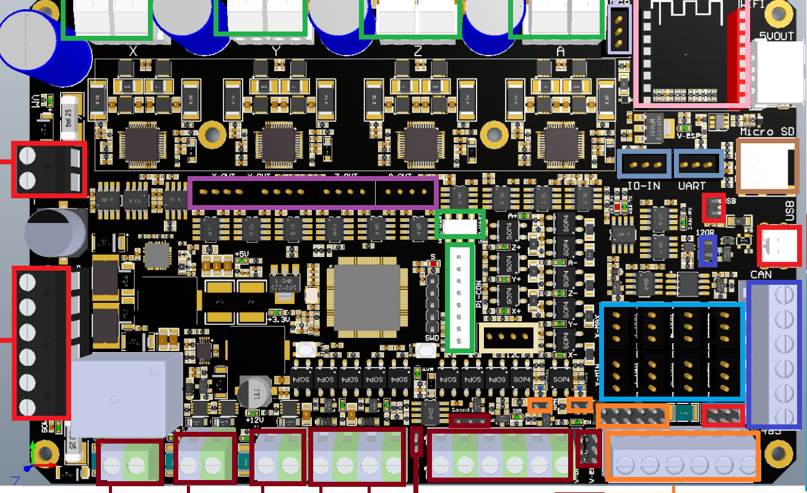
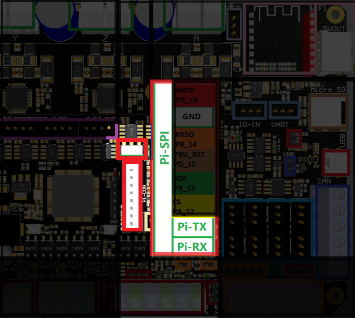
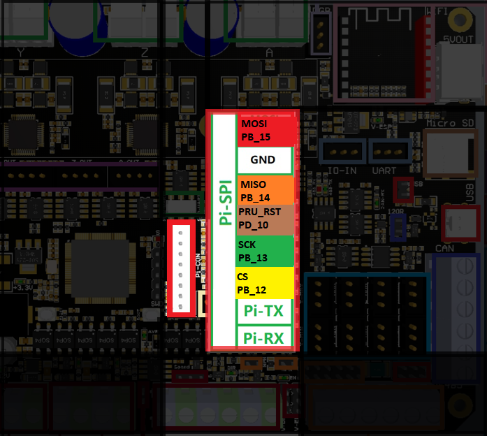
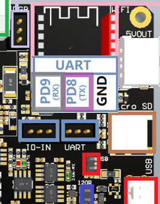

Bigtreetech Scylla
====================

Wiring for the Scylla boards is very straight forward with all pins directly available on the EXP2 header.

	

BTT SCYLLA

Remora Details
--------------
| **Board:**   BTT Scylla
| **MCU:**	STM32H723
| **Communication:**	SPI
| **Firmware:**	      STM32H723/BTT_SCYLLA 
| **Firmware Source:**		
| **LinuxCNC Driver:**      "remora-spi"
| **PRU Base Frequency:** 40000 - 80000
| **Supported Modules:**    

Firmware
-------------------
The Scylla has several different versions. 

Firmware is loaded by putting the approiate firmware on the SD card, and the bootloader will install it from the SD card

In your .hal file, you will need to load the Remora driver

.. code-block::

		loadrt remora-spi 

Config
-------
A sample config.txt for the BTT Scylla is located in the Remora repo under FIrmware/ConfigSamples/Scylla

The config must be named config.txt and must be stored on the SD card. It must remain in the board. 

Hardware Pins
-------------
Remora firmware has some features available only on specific hardware pins. These pins can vary between STM32 boards.

RS485
-------------
The Scylla board is equiped with an RS485 converter for spindle control. It can be used by connecting the Rx and Tx pins to the Raspberry Pi and controlling it over the serial port. The Scylla converts the RS485 and the dipswitch bypasses the MCU and sends serial directly to the Raspberry Pi. This Process is seperate to Remora firmware and not covered in the scope of this document. 

 Scylla RS-485

Wiring
------
The wiring for both versions are the same, except UART is in a different location.
Wiring requires the following components:

* 100mm Female-Female Dupont ribbon jumper
* 10 way (2x5) Dupont connector
* 8 way (2x4) Dupont connector

+--------+----------+----------------------+-------------+
| PIN    | COLOR    |   FUNCTION  	   | RPI PIN     |
+--------+----------+----------------------+-------------+
| PB_15  | RED      | SPI_MOSI   	   | RPI_PIN_19  |
+--------+----------+----------------------+-------------+
| PB_14  | ORANGE   |  SPI_MISO 	   | RPI_PIN_21  | 
+--------+----------+----------------------+-------------+
| PB_13  | GREEN    | SPI_SCK		   | RPI_PIN_23  | 
+--------+----------+----------------------+-------------+
| PB_12  | YELLOW   |  SPI_SSEL  	   | RPI_PIN_24  | 
+--------+----------+----------------------+-------------+
| PB_10  | BROWN    | PRU Reset	  	   | RPI_PIN_22  | 
+--------+----------+----------------------+-------------+
| PD_8   | PURPLE   | MCU TX to RPI RXD    | RPI_PIN_10  |
+--------+----------+----------------------+-------------+
| PD_9   | GREY     | MCU RX to RPI TXD    | RPI_PIN_8   |
+--------+----------+----------------------+-------------+

	

BTT Scylla 
	
To UART from the Raspberry Pi to the Scylla the follwoing components are requried:

* 150mm or 200mm Female-Female Dupont ribbon jumper
* 5 way (1x5) Dupont connector
* 5 way (1x5) Dupont connector

	

    
Scylla v1.1

The diagram above includes the optional serial debug interface. Note that TX <-> RXD and RX <-> TXD.
