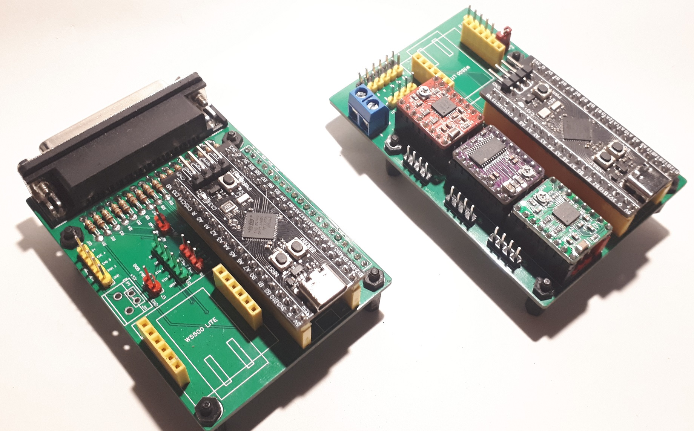
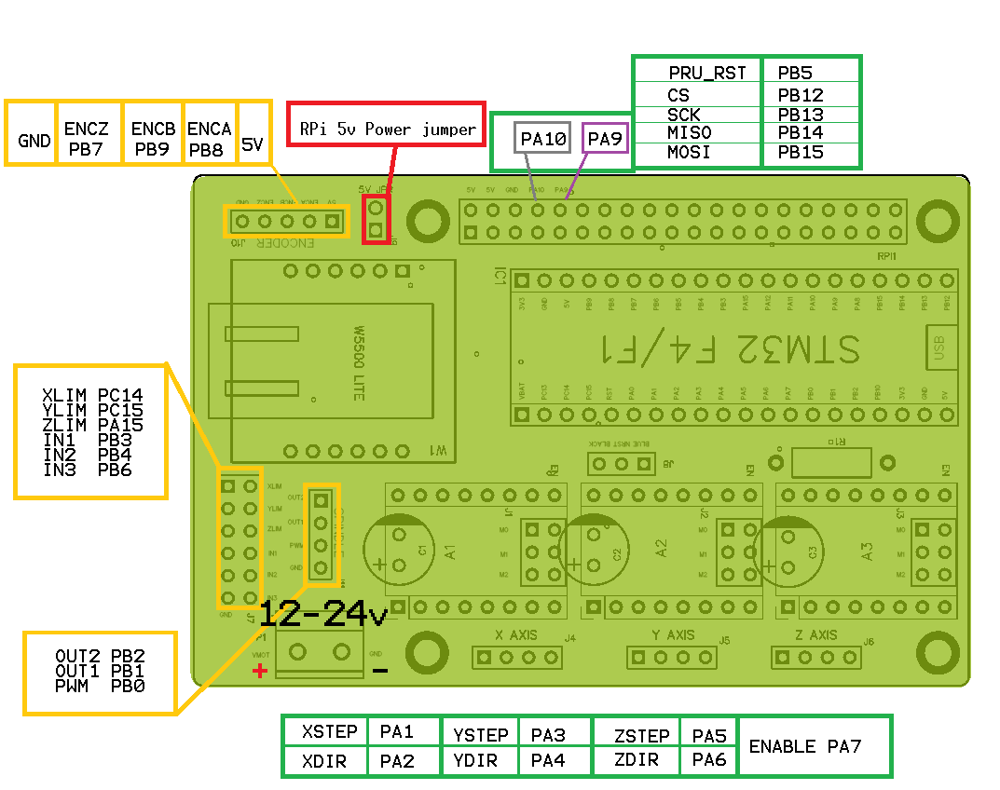
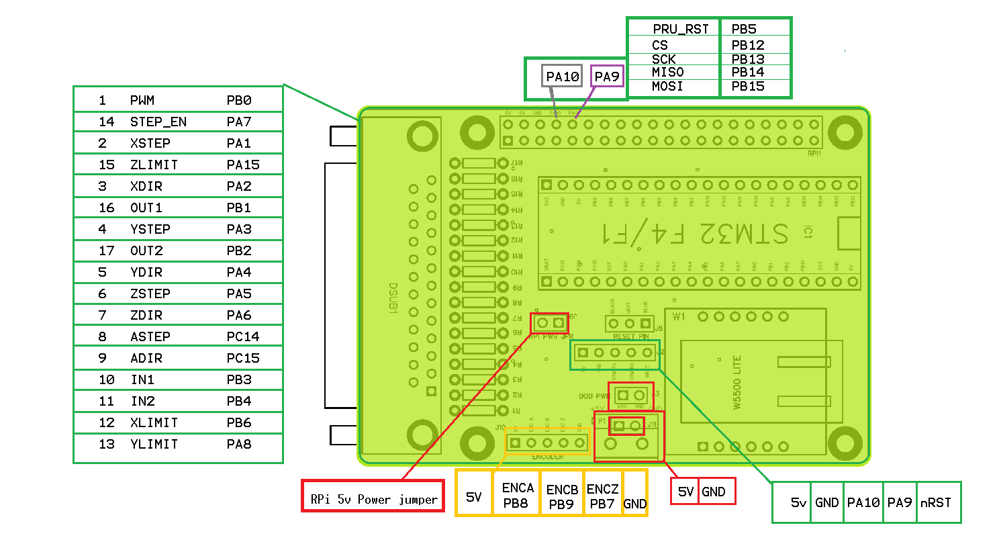
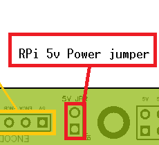

STM32F4x1 Blackpill CNC board
====================================

STM32F4x1 Blackpill CNC board with Remora firmware. 

	

STM32F4x1 with CNC board

This document covers running Remora firmware on LinuxCNC with a fixed configuration.
This page is specific to the Blackpill CNC board hardware. The Firmware is specific to the Blackpill board running the STM32F4x1 mcu with a Remora CNC board as its default configuration.  

The config includes, but is not limited to : 

* 3-4x stepgens for XYZ/A axis 
* 1x Highspeed encoder for spindle or high resolution encoder
* 5-6x inputs for limit switches and buttons
* 2x outputs  
* 1x PWM
* PRU Reset pin (Raspberry Pi version)

Firmware and Config
====================

This firmware is specific to the Blackpill in combination with the Remora CNC Board as its default configuration. There are several versions of the firmware to match the possible communication and configuration hardware variants. For example, SPI Communication with a Static configuration, Ethernet Communication  etc. 

Communication Variants :
-------------------------

* SPI Communication with Static Configuration 
	* This firmware is used in conjunction with the Raspberry Pi, it communicates with Linuxcnc via SPI
	* The pinout is configured with the "board_config.h" file found in the firmware source and compiled with the target. 
	* To modify the pinout, the configuration needs to be modified in firmware and recompiled. This will not be covered in the documents at this time.

* SPI Communication with SD card Configuration 
	* This firmware is used in conjunction with the Raspberry Pi, it communicates with Linuxcnc via SPI
	* The pinout is configured with a "config.txt" file which is stored on an SD card and inmserted intothe board. 
	* To modify the pinout, remove SD card and modify file. It is the same as stadard Remora SPI firmware

* Ethernet Communication with TFTP Upload- **IN DEVELOPMENT**
	* This firmware is used in conjunction with the Wiz W5500 SPI-Ethernet chip adapter. It communicates with Linuxcnc via Ethernet and can be used with regular computer hardware. 
	* This firmware is still in development, documents may change in the future. The firmware provided is the functioning proof of concept firmware. 
	* Load config to internal flash memory via TFTP protocol using upload_config.py python script

Loading firmware  :
-------------------------
**Note** : This document will not cover the steps for loading firmware. It is a standard affair with many other guides online. 

There are 2 ways to load the firmware

* DFU via USBC
* STLINK (prefered) 

Pinout Configuration
=====================

The Stepgens and limit switches are configured to match the pins on the CNC board.
 You do not need to use the CNC board, but this project is default configured for the CNC board. 

StepStick v0.1 Pinout Configuration
----------------------------------------

+--------+------------------------------+----------------+
| PIN    |FUNCTION			| LinuxCNC PIN   |
+========+==============================+================+
| PA_4   | X AXIS STEP 			| remora.joint.0 |
+--------+------------------------------+----------------+
| PA_3   | X AXIS DIR  			| remora.joint.0 | 
+--------+------------------------------+----------------+
| PA_6   | Y AXIS STEPGEN   	 	| remora.joint.1 | 
+--------+------------------------------+----------------+
| PA_5   | Y AXIS DIR    		| remora.joint.1 | 
+--------+------------------------------+----------------+
| PB_1   | Z AXIS STEPGEN 		| remora.joint.2 | 
+--------+------------------------------+----------------+
| PA_7   | Z AXIS DIR     	  	| remora.joint.2 | 
+--------+------------------------------+----------------+
| PA_15  | QEI  ENCODER CHANNEL A	| remora.PV.5    | 
+--------+------------------------------+----------------+
| PA_1   | QEI ENCODER CHANNEL B	| remora.PV.5    | 
+--------+------------------------------+----------------+
| PA_2   | QEI ENCODER CHANNEL INDEX	| remora.input.15| 
+--------+------------------------------+----------------+
| PB_0   | PWM OUTPUT 			| remora.SP.0  	 | 
+--------+------------------------------+----------------+
| PB_9   | X-LIMIT			| remora.input.0 |
+--------+------------------------------+----------------+
| PB_8   | Y-LIMIT 			| remora.input.1 |
+--------+------------------------------+----------------+
| PB_7   | Z-LIMIT			| remora.input.2 |
+--------+------------------------------+----------------+
| PB_6   | IN1				| remora.input.3 |
+--------+------------------------------+----------------+
| PB_4   | IN2				| remora.input.4 |
+--------+------------------------------+----------------+
| PB_3   | IN3				| remora.input.5 |
+--------+------------------------------+----------------+
| PB_2   | STEPPER ENABLE	  	| remora.output.0| 
+--------+------------------------------+----------------+
| PC_13  | OUTPUT 1			| remora.output.1|
+--------+------------------------------+----------------+
| PB_10  | OUTPUT 2			| remora.output.2|
+--------+------------------------------+----------------+

    

DB25 v0.1 Pinout Configuration
----------------------------------------

+--------+------------------------------+----------------+
| PIN    |   FUNCTION  	 	  	| LinuxCNC PIN   |
+========+==============================+================+
| PA_1   |	X AXIS STEP 		| remora.joint.0 |
+--------+------------------------------+----------------+
| PA_2   |	X AXIS DIR  		| remora.joint.0 | 
+--------+------------------------------+----------------+
| PA_3   | 	Y AXIS STEP	    	| remora.joint.1 | 
+--------+------------------------------+----------------+
| PA_4   |	Y AXIS DIR    		| remora.joint.1 | 
+--------+------------------------------+----------------+
| PA_5   | 	Z AXIS STEP 		| remora.joint.2 | 
+--------+------------------------------+----------------+
| PA_6   |	Z AXIS DIR     	  	| remora.joint.2 | 
+--------+------------------------------+----------------+
| PC_14  | 	A AXIS STEP 		| remora.joint.3 | 
+--------+------------------------------+----------------+
| PC_15  |	A AXIS DIR     	  	| remora.joint.3 | 
+--------+------------------------------+----------------+
| PB_8   | QEI  ENCODER CHANNEL A	| remora.PV.5    | 
+--------+------------------------------+----------------+
| PB_9   | QEI ENCODER CHANNEL B	| remora.PV.5    | 
+--------+------------------------------+----------------+
| PB_7   | QEI ENCODER CHANNEL INDEX	| remora.input.15| 
+--------+------------------------------+----------------+
| PB_0   | PWM OUTPUT 			| remora.SP.0  	 | 
+--------+------------------------------+----------------+
| PB_6   | X-LIMIT			| remora.input.0 |
+--------+------------------------------+----------------+
| PA_8   | Y-LIMIT 			| remora.input.1 |
+--------+------------------------------+----------------+
| PA_15  | Z-LIMIT			| remora.input.2 |
+--------+------------------------------+----------------+
| PB_3   | IN1				| remora.input.3 |
+--------+------------------------------+----------------+
| PB_4   | IN2				| remora.input.4 |
+--------+------------------------------+----------------+
| PA_0   | USR_BTN			| remora.input.5 |
+--------+------------------------------+----------------+
| PA_7   | STEPPER ENABLE	  	| remora.output.0| 
+--------+------------------------------+----------------+
| PB_1   | OUTPUT 1			| remora.output.1|
+--------+------------------------------+----------------+
| PB_2   | OUTPUT 2			| remora.output.2|
+--------+------------------------------+----------------+

RPi 5v Power Jumper
---------------------

The CNC board provides the option to power the board via RPi 5v header pins or external. If you wish to power the board from an external 5v source, or you are uasing the blackpill USBc, remove the jumper. The jumper is found in different locations for each board, but will be marked " RPI 5v PWR JPR"

Hardware Pins
-------------
Remora firmware has some features available only on specific hardware pins. These pins can vary between STM32 boards.
If you are using the SD config firmware, you can configure the pins different than the default, but some functions are tied to specific pins.

Available PWM Hardware pins:

- PA_1 PA_2 PA_3 PA_5 PA_6 PA_7 PA_8  PA_9 PA_10 PA_11 PA_15
- PB_0 PB_1 PB_3 PB_4 PB_5 PB_6 PB_7 PB_8 PB_9 PB_10 PB_11 
- PC_6 PC_7 PC_8 PC_9

Available QEI Encoder Hardware pins:

- PA_15
- PA_1
- PA_2 is used as Z/index

Wiring to Raspberry Pi/W5500 for SPI Communication
============================================

+--------+----------+----------------------+-------------+
| PIN    | COLOR    |   FUNCTION  	   | RPI PIN     |
+--------+----------+----------------------+-------------+
| PB_15  | RED      | SPI_MOSI   	   | RPI_PIN_19  |
+--------+----------+----------------------+-------------+
| PB_14  | ORANGE   | SPI_MISO  	   | RPI_PIN_21  | 
+--------+----------+----------------------+-------------+
| PB_13  | GREEN    | SPI_SCK		   | RPI_PIN_23  | 
+--------+----------+----------------------+-------------+
| PB_12  | YELLOW   | SPI_SSEL  	   | RPI_PIN_24  | 
+--------+----------+----------------------+-------------+
| PB_5   | BROWN    | PRU/W5500 Reset  	   | RPI_PIN_22  | 
+--------+----------+----------------------+-------------+
| GND    | BLACK    | GROUND	   	   | GND         | 
+--------+----------+----------------------+-------------+
| PA_9   | 	    | MCU TX to RPI RXD    | RPI_PIN_10	 |
+--------+----------+----------------------+-------------+
| PA_10  | 	    | MCU RX to RPI TXD    | RPI_PIN_08	 |
+--------+----------+----------------------+-------------+

SD Card SPI Communication
============================================

+--------+----------+----------------------+
| PIN    | COLOR    |   FUNCTION  	   |
+--------+----------+----------------------+
| PB_15  | RED      | SD_MOSI   	   |
+--------+----------+----------------------+
| PB_14  | ORANGE   | SD_MISO	  	   | 
+--------+----------+----------------------+
| PB_13  | GREEN    | SD_SCK		   |
+--------+----------+----------------------+
| PA_0   | YELLOW   | SD_SSEL	  	   |
+--------+----------+----------------------+
| GND    | BLACK    | GROUND	   	   |
+--------+----------+----------------------+
| V3.3   | WHITE    | 3.3v power   	   |
+--------+----------+----------------------+

	

Serial Communication
=====================
UART to the CNC board is PA9/PA10. It is connected to the RPi thhrough the 40 pin header, or through the 4 pin serial connector. You can use this to read serial output from the board, using a program like cutecom or minicom. 
