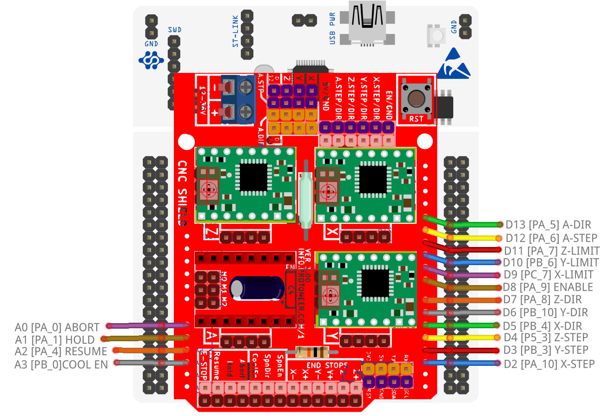

STM32F4x1 Blackpill CNC board
====================================

STM32F4x1 Blackpill CNC board with Remora firmware. 

	
.. image:: ../_static/nucleo446_cnc.png
    :align: center

STM32F4x1 with CNC board

This document covers running Remora firmware on LinuxCNC with a fixed configuration.
This page is specific to the Blackpill CNC board hardware. The Firmware is specific to the Blackpill board running the STM32F4x1 mcu with a Remora CNC board as its default configuration.  

The config includes, but is not limited to : 

* 3-4x stepgens for XYZ/A axis 
* 1x Highspeed encoder for spindle or high resolution encoder
* 5-6x inputs for limit switches and buttons
* 2x outputs  
* 1x PWM
* PRU Reset pin (Raspberry Pi version)

Firmware and Config
====================

This firmware is specific to the Blackpill in combination with the Remora CNC Board as its default configuration. There are several versions of the firmware to match the possible communication and configuration hardware variants. For example, SPI Communication with a Static configuration, Ethernet Communication  etc. 

Communication Variants :
-------------------------

* SPI Communication
	* This firmware is used in conjunction with the Raspberry Pi, it communicates with Linuxcnc via SPI

* Ethernet Communication - **IN DEVELOPMENT**
	* This firmware is used in conjunction with the Wiz W5500 SPI-Ethernet chip adapter. It communicates with Linuxcnc via Ethernet and can be used with regular computer hardware. 
	* This firmware is still in development, documents may change in the future. The firmware provided is the functioning proof of concept firmware. 
	

Cofiguration Variants :
-------------------------

* SD Card Configuration - not implimented
	* The pinout is configured via "config.txt" , which is loaded on the SD card. Pinout can be changed by modifying the file. 
	* An SD Card module needs to needs to be present to used this feature, and connected to the approiate SPI pins. 
	* The default config file is configured for the CNC Shield pinout, but can be changed to use other pinouts
	* **Note** : SD cards running over SPI can be finicky. It is recomended to use an SD card under 1gb
	* **Note** : The Blackpill can tolerate 5v but its IO are 3.3v, It may be required that your SD module some kind of a resistor
	
* Static Configuration 
	* The pinout is configured with the "board_config.h" file found in the firmware source and compiled with the target. 
	* To modify the pinout, the configuration needs to be modified in firmware and recompiled. This will not be covered in the documents at this time.
	* No SD card module is needed.
	
* TFTP Upload	
	* Load config to internal flash memory via TFTP protocol using upload_config.py python script

Pinout Configuration
=====================

The Stepgens and limit switches are configured to match the pins on the CNC board.
 You do not need to use the CNC board, but this project is default configured for the CNC board. 

CNC Shield Default Pinout Configuration
----------------------------------------

+--------+------------------------------+----------------+
| PIN    |   FUNCTION  	 	  	| LinuxCNC PIN   |
+--------+------------------------------+----------------+
| PA_1   |	X AXIS STEP 		| remora.joint.0 |
+--------+------------------------------+----------------+
| PA_2   |	X AXIS DIR  		| remora.joint.0 | 
+--------+------------------------------+----------------+
| PA_3   | 	Y AXIS STEPGEN    	| remora.joint.1 | 
+--------+------------------------------+----------------+
| PA_4   |	Y AXIS DIR    		| remora.joint.1 | 
+--------+------------------------------+----------------+
| PA_5   | 	Z AXIS STEPGEN 		| remora.joint.2 | 
+--------+------------------------------+----------------+
| PA_6   |	Z AXIS DIR     	  	| remora.joint.2 | 
+--------+------------------------------+----------------+
| PB_8   | QEI  ENCODER CHANNEL A	| remora.PV.5    | 
+--------+------------------------------+----------------+
| PB_9   | QEI ENCODER CHANNEL B	| remora.PV.5    | 
+--------+------------------------------+----------------+
| PB_7   | QEI ENCODER CHANNEL INDEX	| remora.input.15| 
+--------+------------------------------+----------------+
| PB_0   | PWM OUTPUT 			| remora.SP.0  	 | 
+--------+------------------------------+----------------+
| PC_14  | X-LIMIT			| remora.input.0 |
+--------+------------------------------+----------------+
| PB_15  | Y-LIMIT 			| remora.input.1 |
+--------+------------------------------+----------------+
| PA_15  | Z-LIMIT			| remora.input.2 |
+--------+------------------------------+----------------+
| PB_3   | IN1				| remora.input.3 |
+--------+------------------------------+----------------+
| PB_4   | IN2				| remora.input.4 |
+--------+------------------------------+----------------+
| PB_6   | IN3			| remora.input.5 |
+--------+------------------------------+----------------+
| PC_13  | USR_BTN			| remora.input.6 |
+--------+------------------------------+----------------+
| PA_7   | STEPPER ENABLE	  	| remora.output.0| 
+--------+------------------------------+----------------+
| PB_1   | OUTPUT 1			| remora.output.1|
+--------+------------------------------+----------------+
| PB_2   | OUTPUT 2			| remora.output.2|
+--------+------------------------------+----------------+

    

Hardware Pins
-------------
Remora firmware has some features available only on specific hardware pins. These pins can vary between STM32 boards.
If you are using the SD config firmware, you can configure the pins different than the default, but some functions are tied to specific pins.

Available PWM Hardware pins:

-  PA_1 PA_2 PA_3 PA_5 PA_6 PA_7 PA_8  PA_9 PA_10 PA_11 PA_15
- PB_0 PB_1 PB_3 PB_4 PB_5 PB_6 PB_7 PB_8 PB_9 PB_10 PB_11 
- PC_6 PC_7 PC_8 PC_9

Available QEI Encoder Hardware pins:

- PB_8
- PB_9
- PB_7 is used as Z/index

Wiring to Raspberry Pi for SPI Communication
============================================

Wiring requires the following components:

* 100mm or shorter Female-Female Dupont ribbon jumper
* 6 way (1x6) Dupont connector
* 8 way (2x4) Dupont connector

+--------+----------+----------------------+-------------+
| PIN    | COLOR    |   FUNCTION  	   | RPI PIN     |
+--------+----------+----------------------+-------------+
| PB_15  | RED      | SPI_MOSI   	   | RPI_PIN_19  |
+--------+----------+----------------------+-------------+
| PB_14  | ORANGE   | SPI_MISO  	   | RPI_PIN_21  | 
+--------+----------+----------------------+-------------+
| PB_13  | GREEN    | SPI_SCK		   | RPI_PIN_23  | 
+--------+----------+----------------------+-------------+
| PB_12   | YELLOW   | SPI_SSEL  	   | RPI_PIN_24  | 
+--------+----------+----------------------+-------------+
| PB_5   | BROWN    | PRU Reset	  	   | RPI_PIN_22  | 
+--------+----------+----------------------+-------------+
| GND    | BLACK    | GROUND	   	   | GND         | 
+--------+----------+----------------------+-------------+
| PA_9   | 	    | MCU TX to RPI RXD    | RPI_PIN_10	 |
+--------+----------+----------------------+-------------+
| PA_10  | 	    | MCU RX to RPI TXD    | RPI_PIN_08	 |
+--------+----------+----------------------+-------------+

	

Serial Communication
=====================
UART to the CNC board is PA9/PA10