Nucleo64 F446 with Arduino 3.x CNC shield
====================================

Nucleo64 F446 with Arduino/protoneer 3.x CNC shield with Remora firmware. 

	
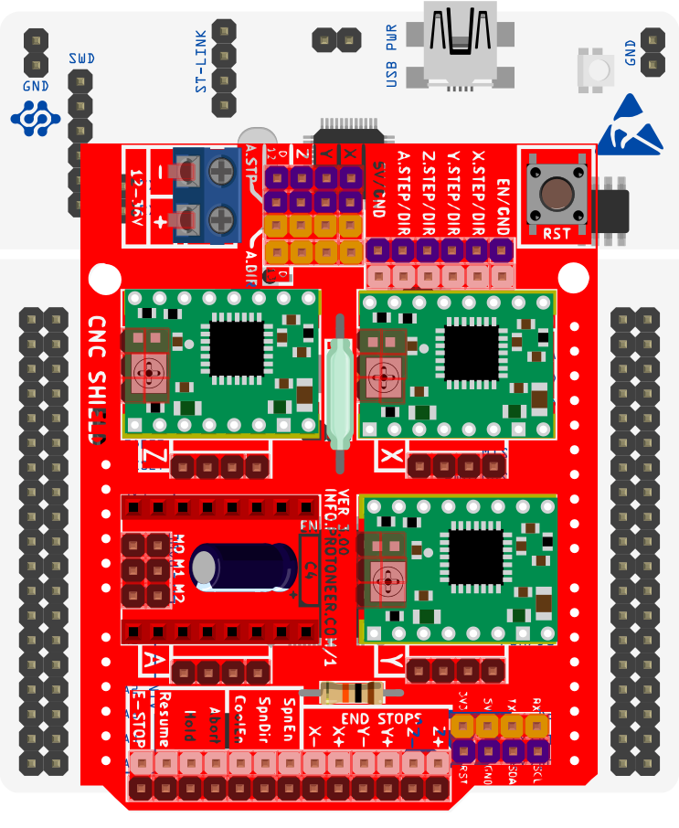

Nucleo64-F446RE with Protoneer CNC shield 3.xx

This document covers running Remora firmware on LinuxCNC with a fixed configuration, and information reguarding the SD card configuration firmware. Information reguarding the configuration of Remora via SD card is covered in detail in the main Remora Documents. 
This page is specific to the Nucleo64 F446RE hardware. The Firmware is specific to the Nucleo board running the STM32F446RE mcu with a Arduino CNC shield v3.xx as its default configuration.  

The config includes, but is not limited to : 

* 4x stepgens for XYZA axis 
* 3x lower resolution encoders with channels A/B
* 1x Highspeed encoder for spindle or high resolution encoder
* 7x inputs for limit switches and buttons
* 2x outputs  
* 1x PWM
* PRU Reset pin (Raspberry Pi version)

Firmware and Config
====================

This firmware is specific to the Nucleo64 F446RE in combination with the classic  cnc shield as its default configuration. There are several versions of the firmware to match the possible communication and configuration hardware variants. For example, SPI Communication with a Static configuration, Ethernet Communication with SD Card configuration, etc. 

Communication Variants :
-------------------------

* SPI Communication
	* This firmware is used in conjunction with the Raspberry Pi, it communicates with Linuxcnc via SPI

* Ethernet Communication
	* This firmware is used in conjunction with the Wiz W5500 SPI-Ethernet chip adapter. It communicates with Linuxcnc via Ethernet and can be used with regular computer hardware. 
	* This firmware is still in development, documents may change in the future. The firmware provided is the functioning proof of concept firmware. 

Cofiguration Variants :
-------------------------

* SD Card Configuration
	* The pinout is configured via "config.txt" , which is loaded on the SD card. Pinout can be changed by modifying the file. 
	* An SD Card module needs to needs to be present to used this feature, and connected to the approiate SPI pins. 
	* The default config file is configured for the CNC Shield pinout, but can be changed to use other pinouts
	* **Note** : SD cards running over SPI can be finicky. It is recomended to use an SD card under 1gb
	* **Note** : The Nucleo 446 can tolerate 5v but its IO are 3.3v, It may be required that your SD module some kind of a resistor
	
* Static Configuration 
	* The pinout is configured with the "board_config.h" file found in the firmware source and compiled with the target. 
	* To modify the pinout, the configuration needs to be modified in firmware and recompiled. This will not be covered in the documents at this time.
	* No SD card module is needed.
	

Pinout Configuration
=====================

The Stepgens and limit switches are configured to match the pins on the CNC Shield. Hardware related configuration for the CNC Shield may be required for some jumper related things. Pins not found on the CNC Shield are found on the Nucleo Morpho headers. You do not need to use the CNC Shield, but this project is default configured for the CNC Shield. 

CNC Shield Default Pinout Configuration
----------------------------------------

+--------+------------------------------+----------------+
| PIN    |   FUNCTION  	 	  	| LinuxCNC PIN   |
+--------+------------------------------+----------------+
| PA_10  |	X AXIS STEP 		| remora.joint.0 |
+--------+------------------------------+----------------+
| PB_4   |	X AXIS DIR  		| remora.joint.0 | 
+--------+------------------------------+----------------+
| PB_3   | 	Y AXIS STEPGEN    	| remora.joint.1 | 
+--------+------------------------------+----------------+
| PB_10  |	Y AXIS DIR    		| remora.joint.1 | 
+--------+------------------------------+----------------+
| PB_5   | 	Z AXIS STEPGEN 		| remora.joint.2 | 
+--------+------------------------------+----------------+
| PA_8   |	Z AXIS DIR     	  	| remora.joint.2 | 
+--------+------------------------------+----------------+
| PA_6   |	A AXIS STEPGEN   	| remora.joint.3 |
+--------+------------------------------+----------------+
| PA_5   |	A AXIS DIR	 	| remora.joint.3 |
+--------+------------------------------+----------------+
| PC_10	 | X AXIS ENCODER CHANNEL A 	| remora.PV.0    | 
+--------+------------------------------+----------------+
| PC_12	 | X AXIS ENCODER CHANNEL B	| remora.PV.0 	 |
+--------+------------------------------+----------------+
| PA_11  | Y AXIS ENCODER CHANNEL A	| remora.PV.1  	 |
+--------+------------------------------+----------------+
| PD_2   | Y AXIS ENCODER CHANNEL B 	| remora.PV.1  	 | 
+--------+------------------------------+----------------+
| PC_2   | Z AXIS ENCODER CHANNEL A 	| remora.PV.2    | 
+--------+------------------------------+----------------+
| PC_3   | Z AXIS ENCODER CHANNEL B 	| remora.PV.2    | 
+--------+------------------------------+----------------+
| PB_8   | QEI  ENCODER CHANNEL A	| remora.PV.5    | 
+--------+------------------------------+----------------+
| PB_9   | QEI ENCODER CHANNEL B	| remora.PV.5    | 
+--------+------------------------------+----------------+
| PA_12  | QEI ENCODER CHANNEL INDEX	| remora.input.15| 
+--------+------------------------------+----------------+
| PC_6   | PWM OUTPUT 			| remora.SP.0  	 | 
+--------+------------------------------+----------------+
| PC_7   | X-LIMIT			| remora.input.0 |
+--------+------------------------------+----------------+
| PB_6   | Y-LIMIT 			| remora.input.1 |
+--------+------------------------------+----------------+
| PA_7   | Z-LIMIT			| remora.input.2 |
+--------+------------------------------+----------------+
| PB_0   | COOLANT			| remora.input.3 |
+--------+------------------------------+----------------+
| PA_0   | ABORT			| remora.input.4 |
+--------+------------------------------+----------------+
| PA_1   | HOLD				| remora.input.5 |
+--------+------------------------------+----------------+
| PA_4   | RESUME			| remora.input.6 |
+--------+------------------------------+----------------+
| PA_9   | STEPPER ENABLE	  	| remora.output.0| 
+--------+------------------------------+----------------+
| PC_8   | OUTPUT 1			| remora.output.1|
+--------+------------------------------+----------------+
| PC_9   | OUTPUT 2			| remora.output.2|
+--------+------------------------------+----------------+

Arduino Header CNC Shield Pinout
----------------------------------

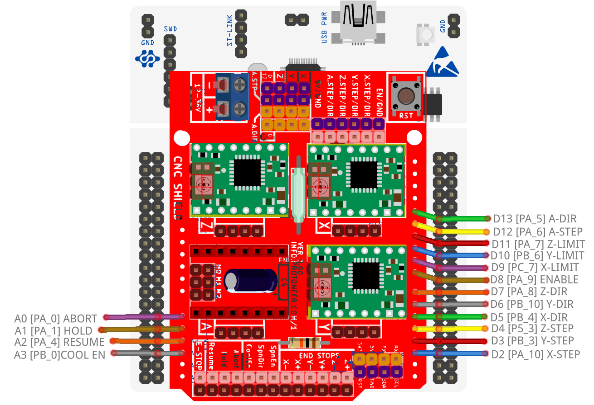
    
Nucleo Morpho Pinout
--------------------

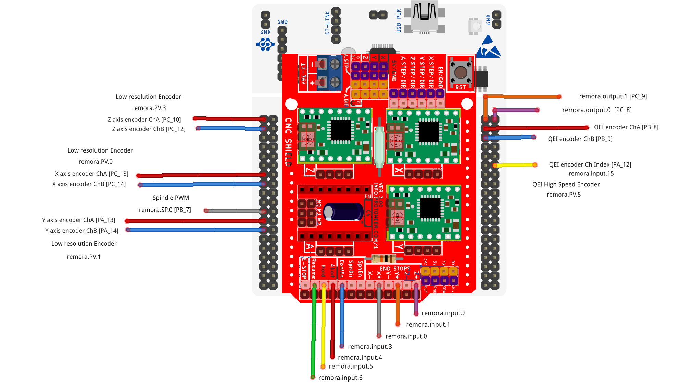
    

Pinout Considerations :
----------------------

* The X+ and X- pins are connected to the same Nucleo IO pin
* The Y+ and Y- pins are connected to the same Nucleo IO pin
* The Z+ and Z- pins are connected to the same Nucleo IO pin
* The SpnEn and SpnDir pins are connected to the same Nucleo IO pin as A axis step and dir
* The E-STOP pin is connected to the mcu reset pin. I do not recoment using it as an estop pin. 

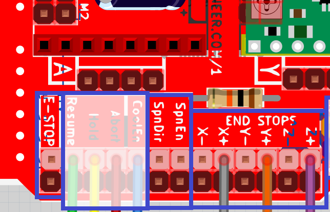

Hardware Pins
-------------
Remora firmware has some features available only on specific hardware pins. These pins can vary between STM32 boards.
If you are using the SD config firmware, you can configure the pins different than the default, but some functions are tied to specific pins.

Available PWM Hardware pins:

-  PA_1 PA_2 PA_3 PA_5 PA_6 PA_7 PA_8  PA_9 PA_10 PA_11 PA_15
- PB_0 PB_1 PB_3 PB_4 PB_5 PB_6 PB_7 PB_8 PB_9 PB_10 PB_11 
- PC_6 PC_7 PC_8 PC_9

Available QEI Encoder Hardware pins:

- PB_8
- PB_9
- PA_12 is used as index

Wiring to SD Module
====================

Wiring the SD Card Module requires it share SPI with our SPI Communication  pins. 
You can use the bottom side pins on the morpho header to access the SPI pins for the SD card module

+--------+----------+----------------------+-------------+
| PIN    | COLOR    |   FUNCTION  	   | SD card PIN |
+--------+----------+----------------------+-------------+
| PB_15  | RED      | SPI_MOSI   	   | MOSI  	 |
+--------+----------+----------------------+-------------+
| PB_14  | ORANGE   | SPI_MISO  	   | MISO        | 
+--------+----------+----------------------+-------------+
| PB_13  | GREEN    | SPI_SCK		   | SCK         | 
+--------+----------+----------------------+-------------+
| PC_4   | YELLOW   | SPI_SSEL  	   | CS          | 
+--------+----------+----------------------+-------------+
| 5/3.3v | BROWN    | POWER  	           | 5 or 3.3v   | 
+--------+----------+----------------------+-------------+
| GND    | BLACK    | GROUND	   	   | GND         | 
+--------+----------+----------------------+-------------+

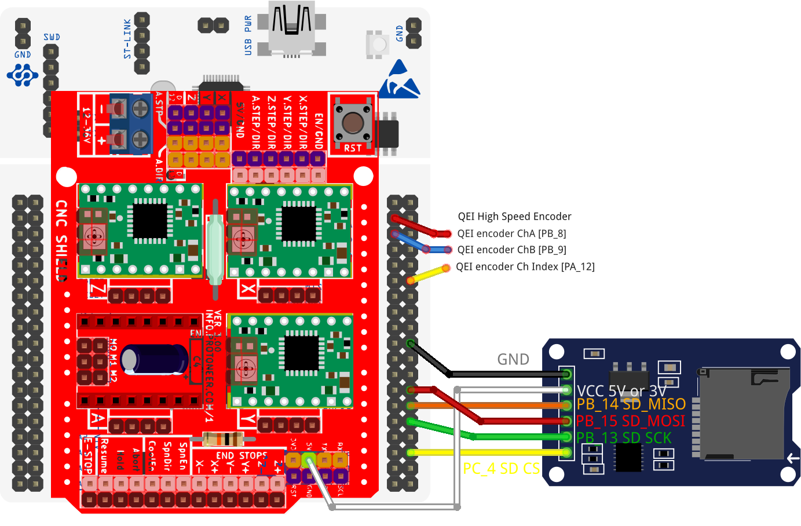
Nucleo connected to SD Card Module

.. image:: ../_static/nucleo446/sd2.jpg
    :align: center
Possible way to bend pins for SD Card Module

Wiring to Raspberry Pi for SPI Communication
============================================

Wiring requires the following components:

* 100mm or shorter Female-Female Dupont ribbon jumper
* 6 way (1x6) Dupont connector
* 8 way (2x4) Dupont connector

+--------+----------+----------------------+-------------+
| PIN    | COLOR    |   FUNCTION  	   | RPI PIN     |
+--------+----------+----------------------+-------------+
| PB_15  | RED      | SPI_MOSI   	   | RPI_PIN_19  |
+--------+----------+----------------------+-------------+
| PB_14  | ORANGE   | SPI_MISO  	   | RPI_PIN_21  | 
+--------+----------+----------------------+-------------+
| PB_13  | GREEN    | SPI_SCK		   | RPI_PIN_23  | 
+--------+----------+----------------------+-------------+
| PB_1   | YELLOW   | SPI_SSEL  	   | RPI_PIN_24  | 
+--------+----------+----------------------+-------------+
| PB_2   | BROWN    | PRU Reset	  	   | RPI_PIN_22  | 
+--------+----------+----------------------+-------------+
| GND    | BLACK    | GROUND	   	   | GND         | 
+--------+----------+----------------------+-------------+
| USB    | 	    | MCU TX to RPI RXD    | USB	 |
+--------+----------+----------------------+-------------+
| USB    | 	    | MCU RX to RPI TXD    | USB	 |
+--------+----------+----------------------+-------------+

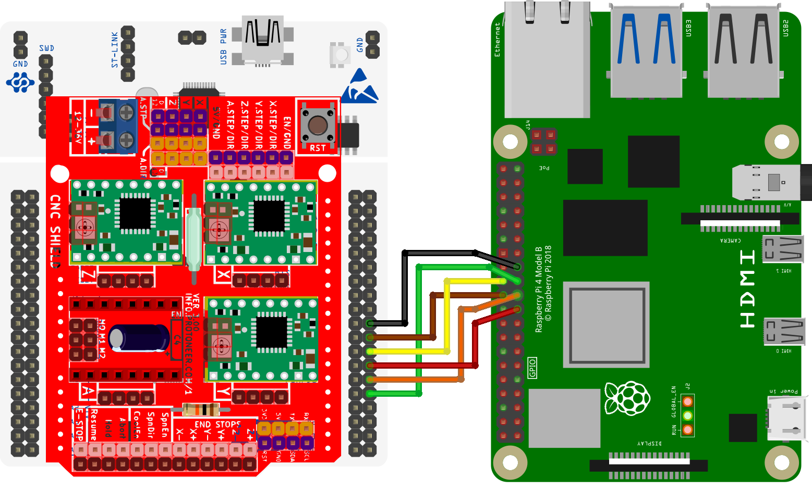
Nucleo connected to Raspberry Pi 4
	
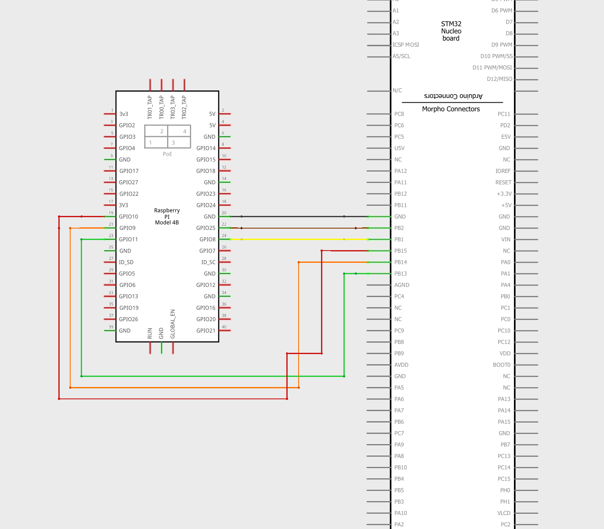
Nucleo to Raspberry Pi 4 schmatic

Wiring to W5500 Ethernet Shield for Ethernet Communication
=========================================================

There are serveral varations of the Arduino W5500 Ethernet Shield, there are several versions of firmware to reflect these differences. 
The W5500 Ethernet Shields are not *directly* compatiable with the CNC Shield, so some minor modifactions may be required depending on which W5500 Ethernet you are using.

* **NOTE:** Many Arduino W5500 Ethernet Shields to not include a low profile Ethernet port. It may be required that you use the stacking Arduino Headers to raise your CNC Shield enough to clear the Ethernet Port

KeyStudio W5500 Ethernet Shield and CNC Shield
------------------------------------------------

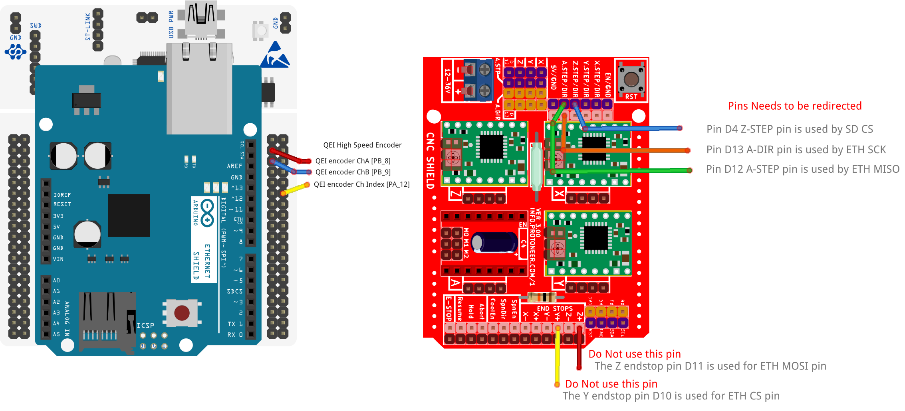

This shield appears to be a clone of the offical Wiz W5500 Ethernet Shield. There are no soldering required to use this board with the CNC Shield, but it is required to use stacking headers to clear the Ethernet Jack and to redirect pins from the CNC Shield. This Shield includes an SD Card slot, which is used for pinout configuration

Following Pins on the CNC shield cannot be connected to the Ethernet Shield

+--------+----------+----------------------+-------------+
| PIN    | COLOR    |   FUNCTION  	   | ETH PIN     |
+--------+----------+----------------------+-------------+
| PA_5   | GREEN    | ETH_SPI_SCK	   | D13	 |
+--------+----------+----------------------+-------------+
| PA_6   | ORANGE   | ETH_SPI_MISO   	   | D12	 | 
+--------+----------+----------------------+-------------+
| PA_7   | RED      | ETH_SPI_MOSI	   | D11	 | 
+--------+----------+----------------------+-------------+
| PB_6   | YELLOW   | ETH_SPI_CS 	   | D10	 | 
+--------+----------+----------------------+-------------+
| PB_5   | BLUE     | SD_SPI_CS		   | D4		 | 
+--------+----------+----------------------+-------------+

* Pin D13 is connected to PA_5, it is used by the Ethernet Shield for SPI_SCK, and by the CNC Shield for A dir. 
 This pin on the CNC Shield cannot be connected to the Ethernet Shild. This Pin can be easily relocated to another pin, using a jumper wire connected from the CNC Shield to the Nucleo Morpho Header. 
* Pin D12 is connected to PA_6, it is used by the Ethernet Shield for SPI_MISO, and by the CNC Shield for A step. 
 This pin on the CNC Shield cannot be connected to the Ethernet Shild. This Pin can be easily relocated to another pin, using a jumper wire connected from the CNC Shield to the Nucleo Morpho Header. 
* Pin D11 is connected to PA_7, which is used by the Ethernet Shield for SPI_MOSI, and by the CNC Shield for Z limit. 
 You cannot use this pin on the CNC Shield, and it should not be connected to the Ethernet shield. 
* Pin D10 is connected to PB_6, which is used by the Ethernet Shield for SD_CS, and by the CNC Shield for Y limit. 
 You cannot use this pin on the CNC Shield, and it should not be connected to the Ethernet shield. 
* Pin D4 is connected to PB_5, it is used by the Ethernet Shield for ETH_CS, and by the CNC Shield for Z step. 
 This pin on the CNC Shield cannot be connected to the Ethernet Shild. This Pin can be easily relocated to another pin, using a jumper wire connected from the CNC Shield to the Nucleo Morpho Header. 

**Shield With Stacking Headers, and removed pins.  :** 

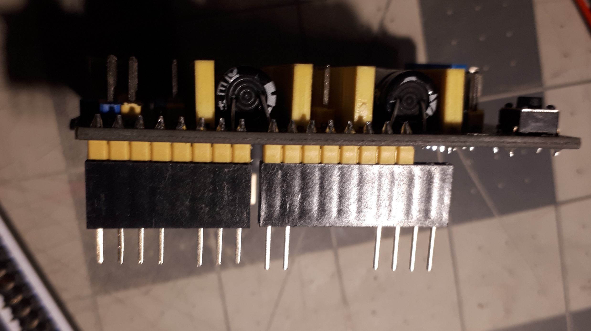

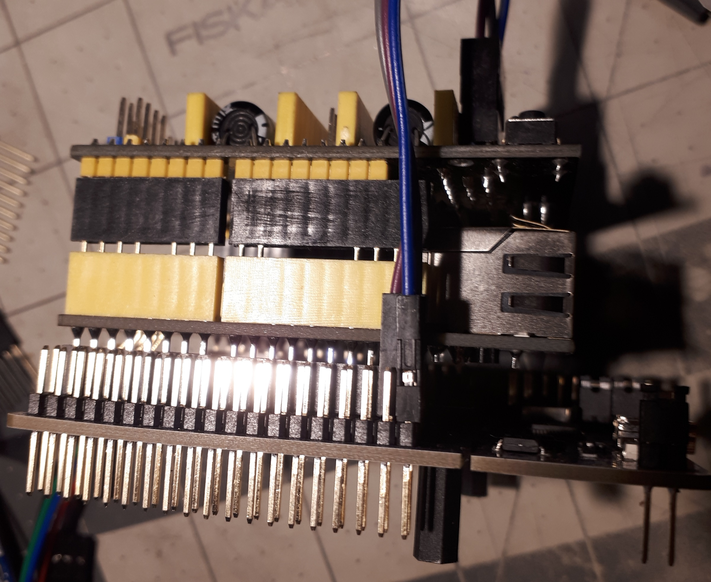

**Shield With Stacking Headers, and Relocated Pins.  :** 

.. image:: ../_static/nucleo446/eth6.jpg
    :align: center

Blue Classic "W5500 Ethernet Shield V2.0" clone from aliexpress
---------------------------------------------------------------

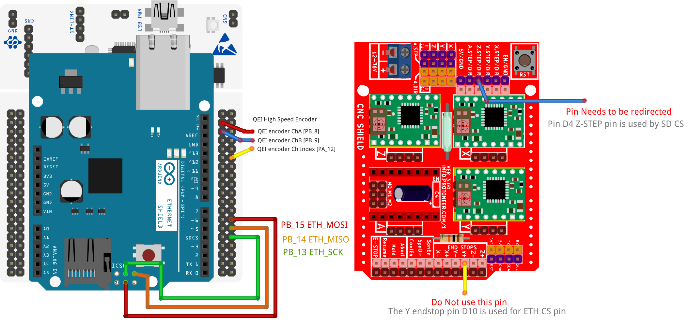

Commonly found on Aliexpress for less than $10, this Ethernet Shield requires the fewest amount of CNC Shield pin relocating, but the most amount of modifications. 
Generally, these Shields are only using 2 pins from the Arduino Header. The rest of the pins required are found on the Arduino ICSP header, which is not connected to the Nucleo. 
How you re-route these pins is up to the user. One option is to remove the original female header and re-solder a new one in its place. This Shield also included an SD card Slot, making Remora configuration more flexiable. The SPI connection is relocated from the ICSP header to use SPI2 for communication. 

+--------+----------+----------------------+-------------+
| PIN    | COLOR    |   FUNCTION  	   | ETH PIN     |
+--------+----------+----------------------+-------------+
| PB_15  | RED      | SPI_MOSI   	   | MOSI ICSP	 |
+--------+----------+----------------------+-------------+
| PB_14  | ORANGE   | SPI_MISO  	   | MISO ICSP	 | 
+--------+----------+----------------------+-------------+
| PB_13  | GREEN    | SPI_SCK		   | SCK ICSP	 | 
+--------+----------+----------------------+-------------+

The other modifaction required is to relocate the pins that are shared on the Arduino header between the 2 shields. This clone Ethernet Shield uses a standard height Ethernet jack, so some kind of header extension is required so the board is not shorted from the Ethernet jack. This works in out favor, as we do not need to remove pins from The CNC Shield. The Following Pins on the CNC shield cannot be connected to the Ethernet Shield

+--------+----------+----------------------+-------------+
| PIN    | COLOR    |   FUNCTION  	   | ETH PIN     |
+--------+----------+----------------------+-------------+
| PB_6   | YELLOW   | ETH_SPI_CS 	   | D10	 | 
+--------+----------+----------------------+-------------+
| PB_5   | BLUE     | SD_SPI_CS		   | D4		 | 
+--------+----------+----------------------+-------------+

* Pin D4 is connected to PB_5, which is used by the Ethernet Shield for SD_CS, and by the CNC Shield for Y limit. 
 You cannot use this pin on the CNC Shield, and it should not be connected to the Ethernet shield. 
* Pin D10 is connected to PB_6, it is used by the Ethernet Shield for SPI_CS, and by the CNC Shield for Z step. 
 This pin the CNC Shield cannot be connected to the Ethernet Shild. This Pin can be easily relocated to another pin, using a jumper wire connected from the CNC Shield to the Nucleo Morpho Header. 

**Before ICSP Mod :**

.. image:: ../_static/nucleo446/eth2.jpg
    :align: center

**After ICSP Mod :** 

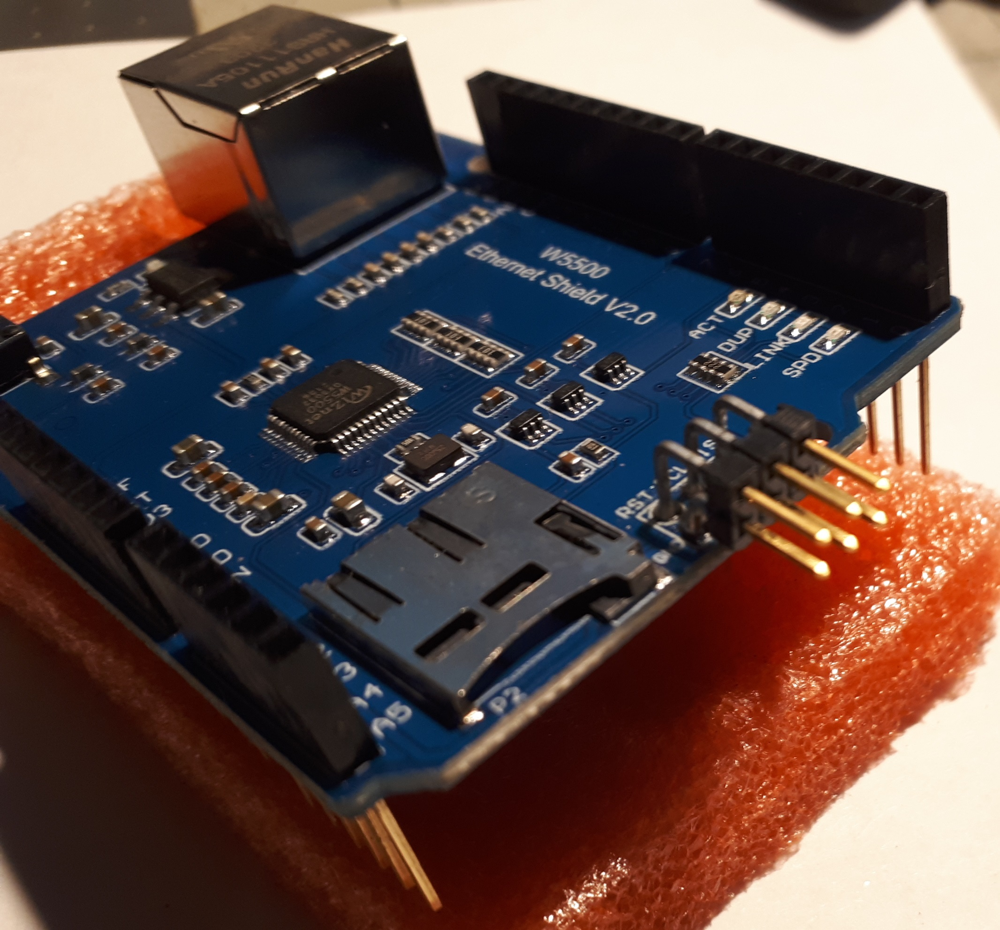

**Shield With Stacking Headers, and removed pins.  :** 

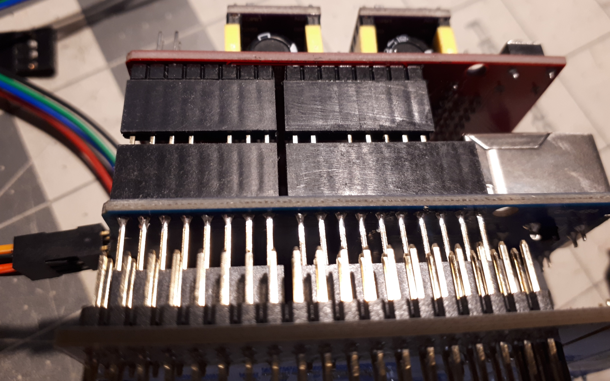

**Shield With Stacking Headers, and Relocated Pins.  :** 

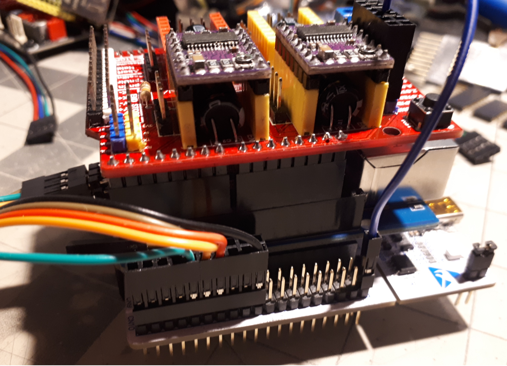
	

Serial Communication
=====================

To USART from the Raspberry Pi to the Nucleo, you can use the usb port on the Nucleo to RPI usb. If you with to use UART on pins PA2/PA3, please refer to the Nucleo usermanual/datasheet. This is currently not supported in the firmware. 

